[](https://classroom.github.com/a/YyUO0xtt)
# COMP2150  - Level Design Document
### Name: [Charlie Adam]
### Student number: [46964215] 

This document discusses and reflects on the design of your platformer level for the Level Design assessment. It should be 1500 words. Make sure you delete this and all other instructional text throughout the document before checking your word count prior to submission. Hint: You can check word count by copying this text into a Word or Google doc.

Your document must include images. To insert an image into your documentation, place it in the "DocImages" folder in this repo, then place the below text where you want the image to appear:

```

```

Example:


## 1. Player Experience (~700 words)
Outline and justify how your level design facilitates the core player experience goals outlined in the assignment spec. Each section should be supported by specific examples and screenshots of your game encounters that highlight design choices made to facilitate that particular experience.

### 1.1. Discovery
What does the player learn? How does your encounter and broader level design facilitate learning in a way that follows good design practice?

Instead of direct written instructions, the player is shown places for exploration and encouraged through sight lines and spatial proximity of objects to experiment and *play* with the new mechanics handed to them. Examples like the visual lures of the checkpoint behind the column in section two, the glimpse of the health box in the overhang part of the refuge space as Ellen descends the pass through platforms and underground, and the placement of the column within the staff room that is close enough for the player to unintentionally hit while instinctively beginning to 'mess around' with the toy. Areas like the centre of section two, where the drop-down underground is, hint at things to be discovered and mastered though exploration and developing their skills with the controls. Things like the moving platforms are explored in a variety of ways, as an elevator to previously unnoticed secrets (section 1, the key), as a way to cross large gaps (section 2, end of tunnel), and moving platforms as an interconnected system of movement to navigate (section 3 , first encounter). This continues to draw new, incidental connections for their use through the player's curiosity, and rewards the player for doing so with earlier gleaned knowledge of game mechanics (the pass-through health box introduction in section 1).


### 1.2. Drama
What is the intensity curve? How does your design facilitate increasing yet modulating intensity, with moments of tension and relief? 
The dramatic curve mapped to the level is  married to the spatial narrative and design of the level, with the sense of freedom and playful exploration from section 1 deepening into the growing tension and complexity amidst the tight spaces and frustration of the more technical encounters. Section 1 uses a slow incline in intensity while remaining fairly light, before an upward spike of surprising gameplay from the elevator moving UP to the newly revealed key before going down the visible gap. Much of the drama, connected with exploration and challenge, is linked in the following two sections

### 1.3. Challenge
What are the main challenges? How have you designed and balanced these challenges to control the difficulty curve and keep the player in the flow channel?
One of the biggest challenges is agility and speed in what is designed to be a dexterous, fast-moving platform experience ( 4-5 minutes playtime based on the expectation of the player going for the speed approach)


I wanted sections dedicated to emphasising one set of mechanics at a time and then gradually coming to build on them. Section 1 is both to reinforce the importance of the movement controls as first and foremost and to create a sense of vulnerability against the few monsters they are exposed to, all of which are melee-based to prompt evasive movement at close quarters. I wanted the progression of challenge foremost to feel natural and connected to the spaces within the level. Section 1 favours making brief contact with things utilised later in the level in conjunction with learning the nuances within jumping and crouching. For example, the second encounter of the section focuses on teaching the player how to shorten their jumps within a cramped space--set slightly above a safety platform patrolled by chompers. Having already likely experienced their reflexes, the mild anxiety of the threat drives the player to perform harder, absorbing them in the task of improvement. Likewise the brief presence of spikes and a small pool of acid to jump over are used to create a sense of tension balanced out by the calmness and leniency of the section jumps and the ability to easily climb back up if they fall. The immediate feedback of damage within a lower stakes setting warns them ahead of time of harder challenges while remaining inside a controlled setting.


Section 2 immediately puts into practice the player's learning from the stepping stones and crystals in section 1 with short, precise jumps as they descend below ground. The enticement of new areas behind a physical obstacle provides a clear goal as well as the promise of choice in direction, as they come to the realisation that to reach the place they must search for something to break through. It also foreshadows the secondary mechanic of the staff to break objects, challenging them to find a way to get through the pillar. The tighter jumps of section one are further put to use in reaching the staff, as the player nagivates a series of spike-studded plinths before reaching a checkpoint as a moment of relief in the same room as the staff pickup. Here the tension is diffused as they begin to play with the staff in a point of safety, before, at their own choosing, they can break the  pillar and descend into a tunnel filled with a hefty lineup of chompers to test out and hone the capabilities of their staff in tandem with their movement to avoid running into the chompers. This is succeeded with a point of refuge in the statue room and checkpoint, and an overhang of rock with an optional chomper encounter in order to obtain an extra health pickup, before the drop to section 3.


Section 3 is meant to convey a sense of the 'safety rails' having been removed---the entire section suspended over a lake of acid only visible if the player is about to fall in, and an entire outcropping of spikes underneath one of the platform encounters as a very present stressor. Having already been introduced to the acid in section one, it is now a threat present in the absence of solid ground--removing the safety platforms and guiding walls of the last two sections. The lack of certainty about what waits underneath adds a new level of stress to engage the player as they put their platforming skills to the test once more, in a change of pace from the previous section's heavy combat. 


The latter also gives the player more room for error, along with flat surfaces just underneath platforms to catch them. 
### 1.4. Exploration
How does your level design facilitate autonomy and invite the player to explore? How do your aesthetic and layout choices create distinct and memorable spaces and/or places?

Aesthetics and layout decisions in my level were heavily influenced by the dramatic arc I had intended for it, with each space shaped by the feeling I wanted to evoke in the player as they went. The lightness and relaxed nature of section one was meant to ease the player in with an exploratory curiosity and emphasis on play. To make a gentle start to the dramatic arc, I wanted section 1 to be filled with lots of light, airiness and plenty of space to move around. 


Section 2 was designed to be reminiscent of a warren, full of tight, cramped and winding passages with lots of nooks and crannies for the player. That in turn better emphasised the creation of a refuge space shortly after the player gets the staff pickup, breaking through into a room that opens up around both a statue and a health box next to the checkpoint that was visible behind the pillar as an objective lure. The pathlines of section 2, while more constricting than section 1, are far more dynamic in how twisting they are, covering far more vertical and horizontal space as the player traverses. I felt both the indirectness of the path and the use of the blocked openings by the central checkpoint creates the illusion of more autonomy in choosing where the player can go. As opposed to the copious use of negative space in section 1 the ramping up of difficulty comes with a refocusing upon positive space and movement within it. 

Section three is precarious and tense with an unknown danger underneath the floating platforms, transforming the negative space of section 1 into a source of anxiety instead of comfort, as well as opening up the space after the claustrophobic tunnels of the last area. 


## 2. Core Gameplay (~400 words)
A section on Core Gameplay, where storyboards are used to outline how you introduce the player to each of the required gameplay elements in the first section of the game. Storyboards should follow the format provided in lectures.

Storyboards can be combined when multiple mechanics are introduced within a single encounter. Each section should include a sentence or two to briefly justify why you chose to introduce the mechanic/s to the player in that sequence.

You should restructure the headings below to match the order they appear in your level.


### 2.2. Checkpoints
Checkpoints are present before they are needed to create a sense of curiosity before they are given a meaning. They are properly introduced in the first acid encounter, if they fall in. They also come to represent a sense of safety and a marker of progress, even in areas without acid.
### 2.3. Chompers(& ### 2.7. Passthrough Platforms & ### 2.4. Health Pickups)
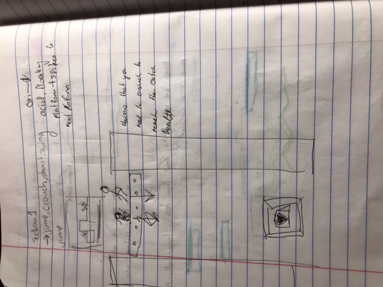
A slightly hidden optional introduction to pass through platforms positioned under where the player would fall if hit by introductory chomper. No weapons to deal with the chomper, only avoidance.
Health pickup and pass through platform are also introduced in the acid and spike encounter if the player doesn't engage with the drop down--here, the player passes *up* through the platform as a staircase instead of having to learn how to drop down. Because the 'S + *then* spacebar' controls proved to not be intuitive during playtesting, this is meant to be a more overt way of teaching by showing that they CAN be moved through. Proves important for dropping down into section 2 proper.
### 2.1. Acid
The acid is not intented to present a true danger in its introduction, only an immediate point of feedback to prepare the player for it in the future. It is easily jumped over, though requires good timing while jumping over the above chompers to avoid falling in from the impact.
### 2.8. Spikes
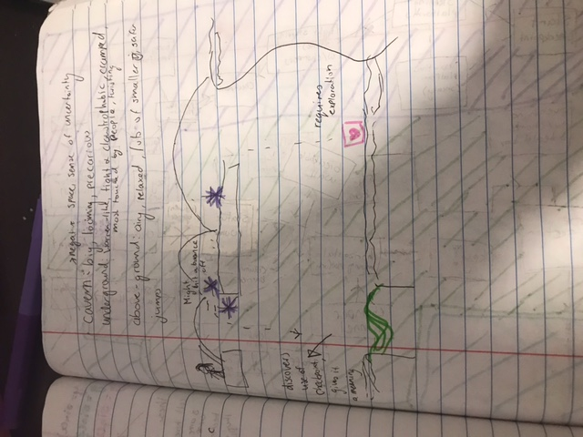
similar intent as acid
### 2.5. Keys ### 2.6. Moving Platforms
elevator requires no skill floor to use, just has to be stood on and moves up, then down. key revealed through section 1 elevator, requires player to jump for it.

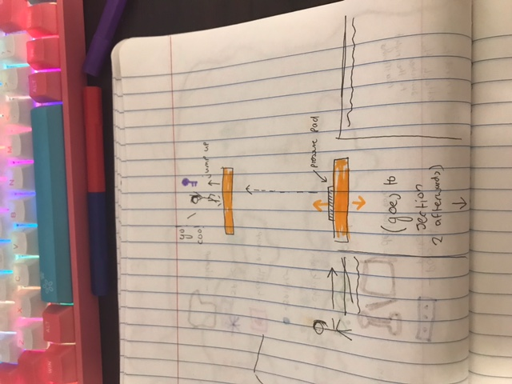
### 2.11. Weapon Pickup (Staff)
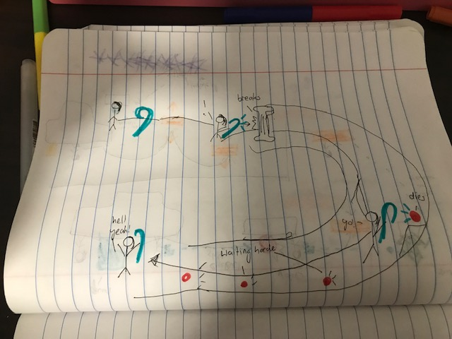
staff both as a way to break obstacles and also a melee weapon
### 2.9. Spitters
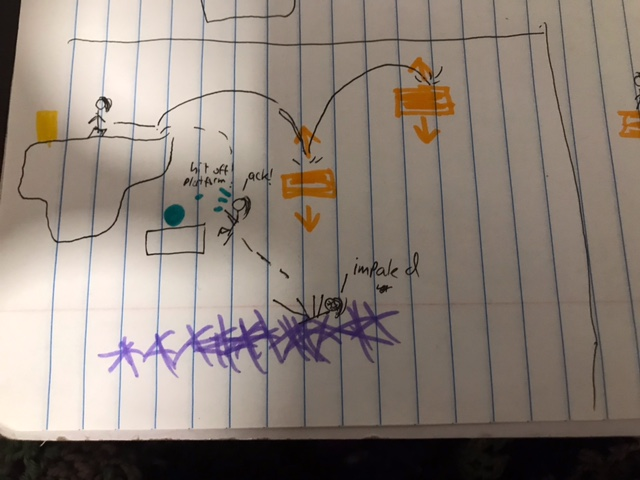
spitter can both injure player and knock em off platforms from afar
### 2.10. Weapon Pickup (Gun)
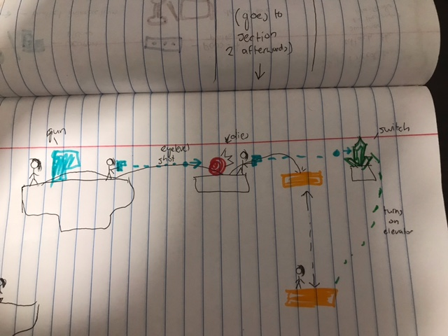

gun introduced as both weapon and trigger for mechanisms
## 3. Spatiotemporal Design
A section on Spatiotemporal Design, which includes your molecule diagram and annotated level maps (one for each main section of your level). These diagrams may be made digitally or by hand, but must not be created from screenshots of your game. The annotated level maps should show the structure you intend to build, included game elements, and the path the player is expected to take through the level. Examples of these diagrams are included in the level design lectures.


No additional words are necessary for this section (any words should only be within your images/diagrams).
 
### 3.1. Molecule Diagram
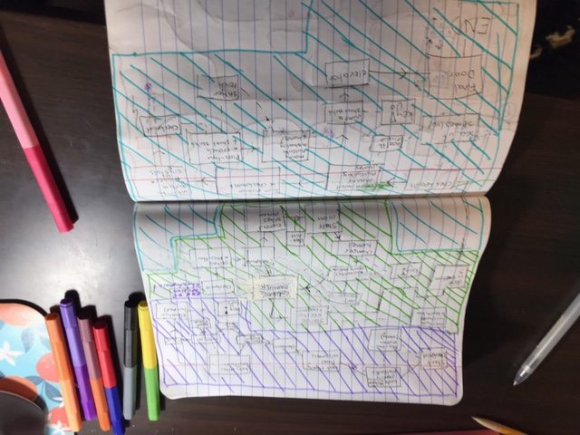
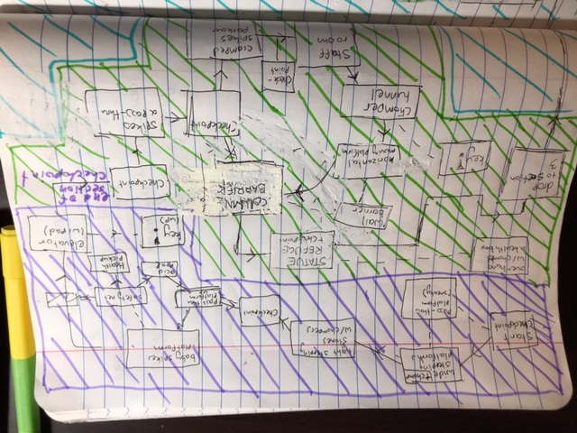
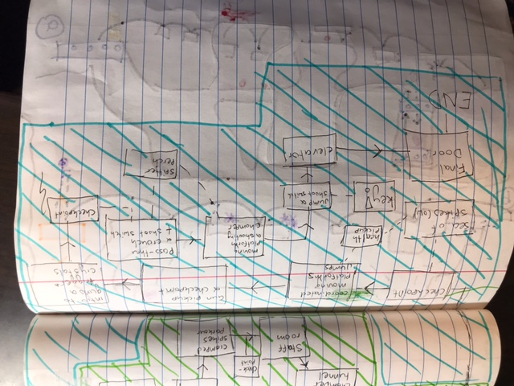
### 3.2. Level Map – Section 1
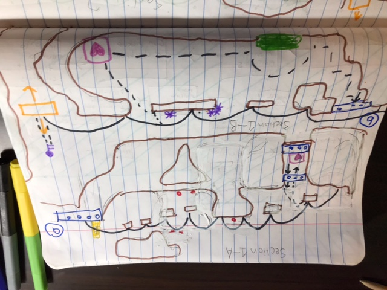
### 3.3.	Level Map – Section 2
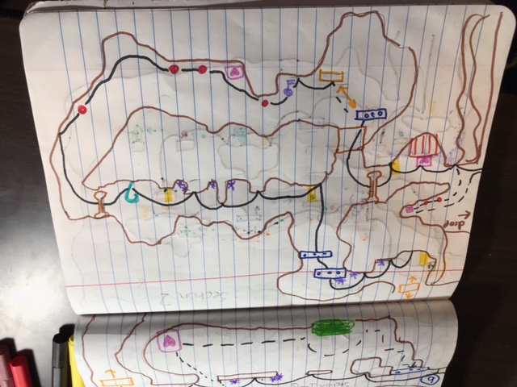
### 3.4.	Level Map – Section 3
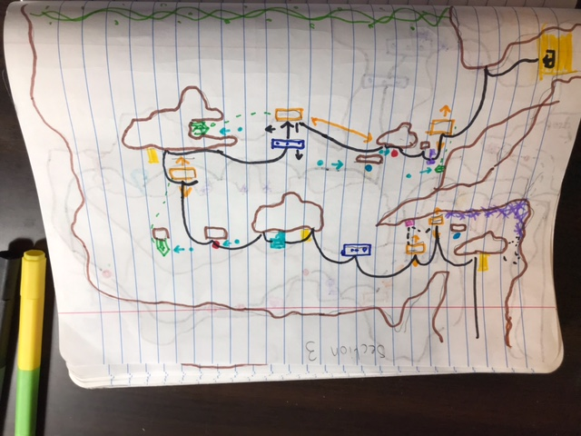
## 4. Iterative Design (~400 words)
Reflect on how iterative design helped to improve your level. Additional prototypes and design artefacts should be included to demonstrate that you followed an iterative design process (e.g. pictures of paper prototypes, early grey-boxed maps, additional storyboards of later gameplay sequences, etc.). You can also use this section to justify design changes made in Unity after you drew your level design maps shown in section 3. 

You should conclude by highlighting a specific example of an encounter, or another aspect of your level design, that could be improved through further iterative design.


The very backbone of this level is in its iterative design, frankly. Through both playtester observation and cumulative ideation, the level has been through perhaps ten iterations. These were all tweaked for balance, experience, and variety as well as how well they made use of the mechanics taught earlier.  Below are a few selected examples from the DocImages folder of how things changed through development (context captions provided in alts):

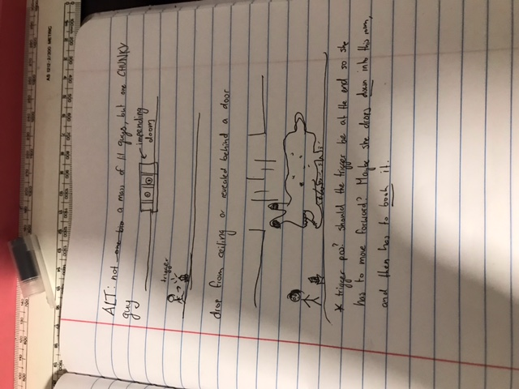
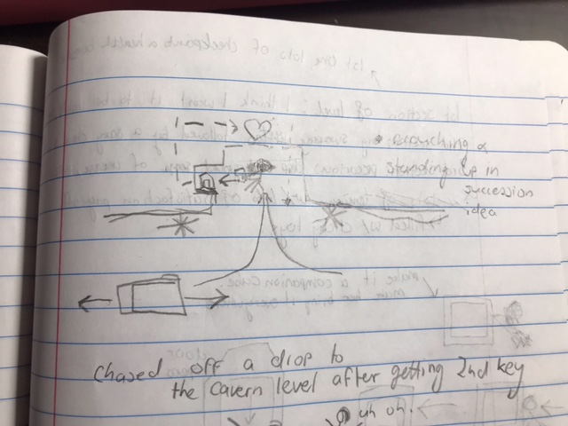
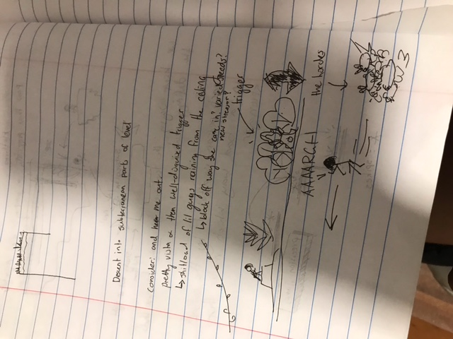
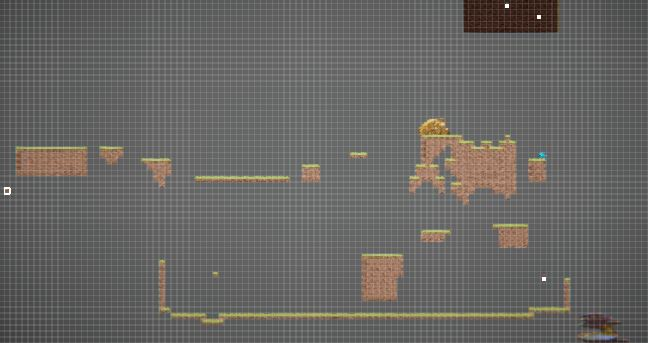
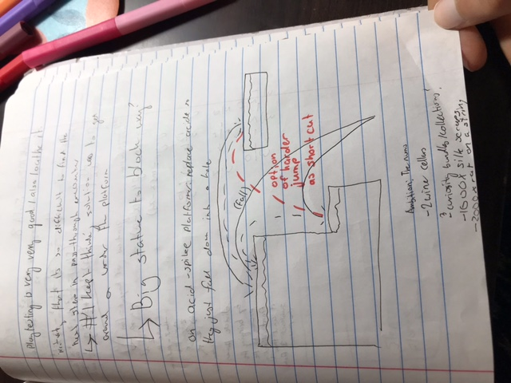
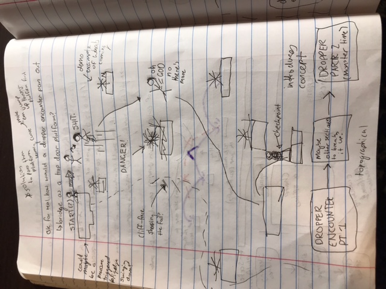
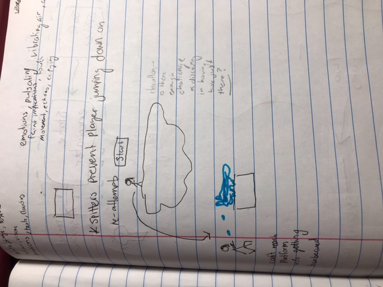
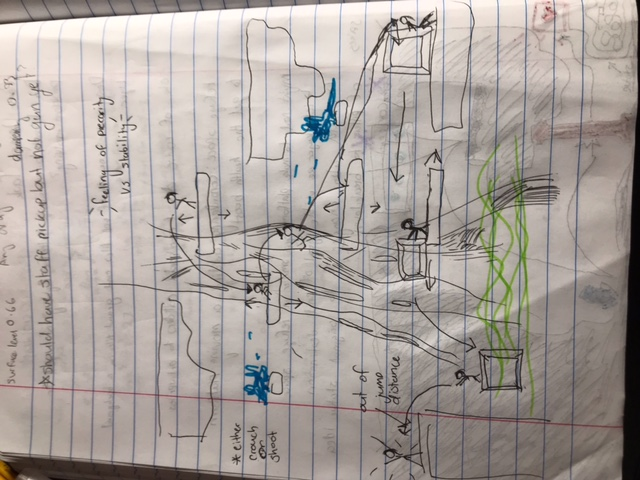
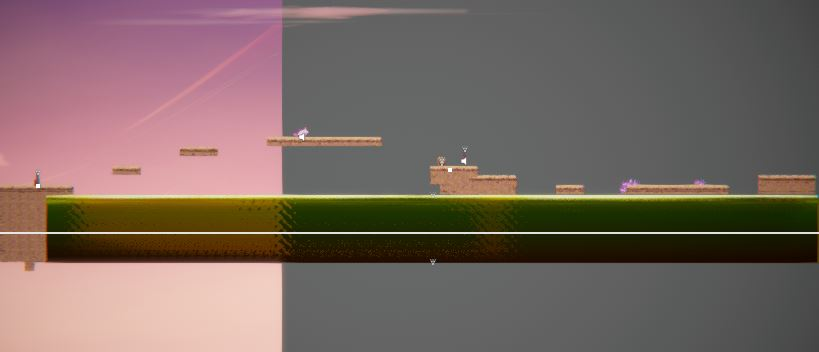

## Generative AI Use Acknowledgement


A particular example of how this level heavily benefitted from iteration was the staff pickup space, which originally didnt have a wide cavern and was directly after the spike plinths. Upon playtesting I realised that I had failed to account for the player's immediate impulse to start playing with the new 'toy' of the staff pickup. Putting the player in a cramped room in proximity to the spikes meant that testers always ended up losing a heart while testing out the staff. Part of the rewarding nature of discovery is that they should not be penalised for experimentation or play, and it was not an intended design goal to force them into needing to be conscious of their surroundings even in times of safety. Therefore, I expanded the space, and then decided that it needed a tunnel to go back to the centre of the section filled with both destructable objects and chompers to engage in melee combat. 

Use the below table to indicate any Generative AI or writing assistance tools used in creating your document. Please be honest and thorough in your reporting, as this will allow us to give you the marks you have earnt. Place any drafts or other evidence inside this repository. This form and related evidence do not count to your word count.
An example has been included. Please replace this with any actual tools, and add more as necessary.


### Tool Used: ChatGPT
**Nature of Use** How dare you assume I would ever use AI outside of at gunpoint
**Evidence Attached?** My life, my creed, on my honour I did not.


### Tool Used: Example
**Nature of Use** My own two hands

**Evidence Attached?** my genius could never be touched by the cold corrosion of synthesised words (willfully arrogant)

**Additional Notes:** Hey since this doesnt go to the word count you can't get mad at me for goofing off in this section right? Come on I put so much effort into the rest of it


